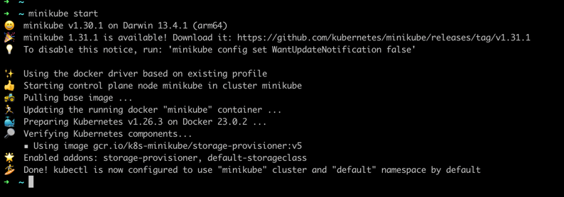

**Vault installation to minikube via Helm with Integrated Storage**

In this tutorial, you will set up Vault and its dependencies with a Helm chart. You will then integrate a web application that uses the Kubernetes service account token to authenticate with Vault and retrieve a secret.

**Prerequisites**

This tutorial requires the[ Kubernetes command-line interface (CLI)](https://kubernetes.io/docs/tasks/tools/) and the [Helm CLI](https://helm.sh/docs/helm/) installed, [Minikube](https://minikube.sigs.k8s.io/), the Vault and Consul Helm charts, the sample web application, and additional configuration to bring it all together.

First, follow the directions to install [Minikube](https://minikube.sigs.k8s.io/docs/start/), including VirtualBox or similar.

Next, install [kubectl CLI](https://kubernetes.io/docs/tasks/tools/) and [helm CLI](https://github.com/helm/helm#install).

Start Minikube
Minikube is a CLI tool that provisions and manages the lifecycle of single-node Kubernetes clusters running inside Virtual Machines (VM) on your local system.

Start a Kubernetes cluster.

Install the Vault Helm chart

Add the HashiCorp Helm repository.

``helm repo add hashicorp https://helm.releases.hashicorp.com`` 

``helm repo update``

Install the latest version of the Vault Helm chart with Integrated Storage.