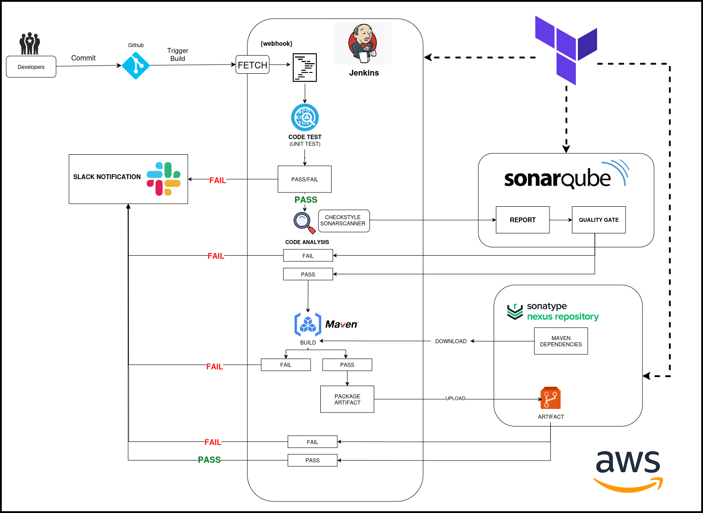

# Problem

- There are frequent untested changes being made by developers and this could end up breaking something in the system.

- Not testing code frequently migt lead to an acumulation of bugs and error.

- Sometimes developers are unable or forget to test their code 

- Manual Build & Release proccess

# Solution 

- Build and test every commit
- Automation 
- Notify for every build status
- Fix Error found immediatly 

## Applications Used

- Terraforrm
- Jenkins 
- GIT
- MAVEN
- Checkstyle (Code Analysis Tool)
- Slack
- Nexus Sonatype (Artifact Software repository)
- sonarqube 
- AWS EC2 Compute
- Terraform

## Objective 

- Fault Isolation
- Short MTTR
- Fast turn around time 
- Less Distruptive

---

## Installation

Installation Tool: Terraform 
Jenkins Server: Ubuntu
Nexus Server: Centos
Sonaqube: Ubuntu

## Architectural Diagram




### Terraform

> The terraform files used can be founf in the modules directory and the root file system.

- modules/state_resouces: contains hcl for the dynamodb table and s3 bucket used to manage state
- modules/infra-jenkins: contains hcl for jenkins server setup
- modules/infra-nexus: contains hcl for Nexus Repository server setup
- modules/infra-sonar: contains hcl for sonarqube server setup
- modules/security: contains security groups and ssh key hcl.

### AWS CLI Setup

https://docs.aws.amazon.com/cli/latest/userguide/getting-started-install.html

```bash
curl "https://awscli.amazonaws.com/awscli-exe-linux-x86_64.zip" -o "awscliv2.zip"
unzip awscliv2.zip
sudo ./aws/install
```
```bash
curl "https://awscli.amazonaws.com/awscli-exe-linux-x86_64.zip" -o "awscliv2.zip"
unzip awscliv2.zip
sudo ./aws/install --bin-dir /usr/local/bin --install-dir /usr/local/aws-cli --update
```

# TIPS

## Login on your terminal to AWS

`aws configure`

Auto Destroy Infra Module `terraform destroy -target=module.infra --auto-approve`

Get your Instatnce ID:

`aws ec2 describe-instances --query 'Reservations[*].Instances[*].[Tags[?Key==`Name`].Value, InstanceId, State.Name]' --output text`

Terminate Instance:

`aws ec2 terminate-instances --instance-ids i-014c9c6646f3cc5f0`

nexus IP will change any time you reboot the instance - Use the private IP address on your jenkins file.
http://<nexus-server-private-ip>:8081

Update the jenkins IP on noIP account and access from: http://jenkins.zapto.org:8080

> Noip offers one free dommain name which is more than enough for this project.


Maven Dependences are defined in the pom.xml file.

Information needed be maven are specified in the settings.xml and the variables in settings.xml are defined in the jenkins file.

### SSH access from jenkins server to github

Steps:

- Generate a an ssh-key
- Add the public key on github
- Add the private key to jenkins using the GUI
- login to the jenkins server and initiate an ssh request to save the Identity in the known hosts

> Initiate ssh below and save key to allow ssh access from github to jenkins

Run on jenkins server and confim identity in known hosts

```
git ls-remote -h git@github.com:usianej/vprofile.git HEAD
```
